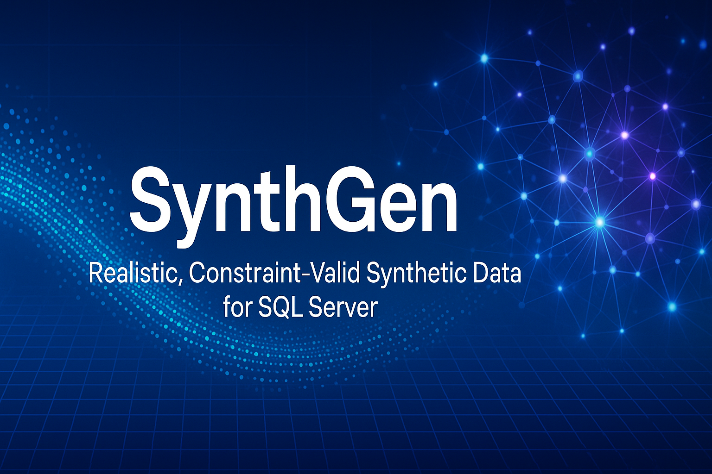
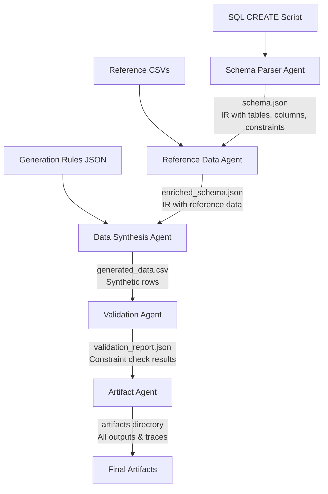

<p align="center">
  
</p>

# SynthGen

SynthGen creates **realistic, constraint‑valid synthetic data** for SQL Server schemas so that teams can develop, test, and demonstrate solutions without exposing production data.

## Overview

SynthGen orchestrates a **team of LLM‑centric agents** supported by lightweight Python helpers to transform SQL Server schema definitions into realistic synthetic data. Each agent in the pipeline specializes in a specific task:

1. **Schema Parser**: Analyzes SQL Server CREATE scripts to build an internal model
2. **Reference Data Loader**: Incorporates lookup values from CSV files with optional distribution weights
3. **Data Synthesizer**: Generates realistic data based on schema constraints and business rules
4. **Validator**: Ensures the generated data meets all constraints
5. **Artifact Collector**: Organizes outputs and debug information

## E-commerce Demo

SynthGen includes a comprehensive **e-commerce demo** that showcases the system's capabilities. This demo generates a complete synthetic e-commerce dataset with users, products, orders, reviews, and more, based on a 30+ table schema with rich relationships.

The demo demonstrates how SynthGen can:

- Parse complex SQL schemas with many tables and relationships
- Respect primary and foreign key constraints
- Generate realistic data that follows business rules
- Create coherent relationships between entities

[View the E-commerce Demo Documentation](demo.md) for a step-by-step walkthrough of the process, including descriptions of all input and output files.

## Requirements Specification

The [Requirements Specification](requirements.md) document provides a detailed overview of SynthGen's purpose, scope, and functionality. It includes:

- Comprehensive user stories from various stakeholder perspectives
- Functional and non-functional requirements
- Acceptance criteria and performance benchmarks
- Scope boundaries and future enhancements

This document serves as the foundation for SynthGen's development and helps ensure all critical features are implemented correctly.

## System Design

The [High-Level Design](design.md) document outlines SynthGen's technical architecture and implementation approach. Key sections include:

- Component diagram showing the agent pipeline
- Intermediate Representation (IR) JSON schema
- Prompt engineering standards
- Artifact directory structure
- Performance targets and extensibility points

The design document provides developers with a clear roadmap for implementation while maintaining flexibility for future enhancements.

## Data Flow Diagram



## Installation

```bash
# Clone the repository
git clone https://github.com/your-org/synthgen.git
cd synthgen

# Create a virtual environment (optional but recommended)
python -m venv venv
source venv/bin/activate  # On Windows: venv\Scripts\activate

# Install dependencies
pip install -r requirements.txt
```

## API Key Setup

SynthGen requires an OpenAI API key to function. You have two options for setting up your key:

1. **Create a `.env` file** in the project root (recommended for development):

   ```
   OPENAI_API_KEY=sk-your-api-key-here
   ```

2. **Set an environment variable**:

   ```bash
   # Linux/macOS
   export OPENAI_API_KEY=sk-your-api-key-here

   # Windows
   set OPENAI_API_KEY=sk-your-api-key-here
   ```

You can verify your API key setup by running:

```bash
python tests/integration/test_openai_connectivity.py
```

For detailed information about API key management and security best practices, see [API_KEY_MANAGEMENT.md](API_KEY_MANAGEMENT.md).

## Usage

### Basic Example

```bash
./cli.py path/to/schema.sql path/to/ref-data/ --rules path/to/rules.json
```

### Command-Line Options

```
usage: cli.py [-h] [--rules RULES] [--artifacts-dir ARTIFACTS_DIR]
              [--run-id RUN_ID] [--seed SEED] [--llm-model LLM_MODEL]
              sql_script ref_data_dir

SynthGen: Generate realistic, constraint-valid synthetic data for SQL Server schemas

positional arguments:
  sql_script            Path to the SQL Server CREATE script for the target schema
  ref_data_dir          Directory containing reference data CSVs (one per lookup table)

optional arguments:
  -h, --help            show this help message and exit
  --rules RULES, -r RULES
                        Path to the Generation-Rules JSON document
  --artifacts-dir ARTIFACTS_DIR, -a ARTIFACTS_DIR
                        Directory to store artifacts and output files (default: artifacts)
  --run-id RUN_ID       Unique identifier for this run (for reproducibility)
  --seed SEED, -s SEED  Random seed for reproducible generation
  --llm-model LLM_MODEL Specific OpenAI model to use (default: gpt-4o)
```

## Reference Data with Distribution Weights

SynthGen allows you to specify distribution weights for reference data, which control how frequently each value appears in the generated data:

```
# [SchemaName.TableName]
CodeValue, Description, Weight
A, Active, 0.7
I, Inactive, 0.2
D, Deleted, 0.1
```

The weights can be specified in CSV files with an optional `Weight` column. When used by the Data Synthesis Agent, these weights will influence the distribution of foreign key references to these values.

Benefits of distribution weights:

- Control over the realism of generated data
- Ability to model real-world frequencies (e.g., mostly active accounts)
- Predictable output patterns for testing specific scenarios

## Project Structure

```
synthgen/
├── agents/             # Agent implementations
├── models/             # Data models and schemas
├── utils/              # Utility functions
├── plugins/            # Extension points
├── schemas/            # JSON schemas
├── tests/              # Test suite
│   ├── unit/           # Unit tests for individual components
│   ├── integration/    # Integration tests across components
│   ├── end_to_end/     # Full pipeline tests
│   └── fixtures/       # Test data and fixtures
├── samples/            # Sample input files
│   ├── sql/            # Example SQL schema files
│   ├── ref_data/       # Example reference data files
│   └── rules/          # Example generation rules
├── artifacts/          # Generated outputs (gitignored)
├── cli.py              # Command-line interface
├── api.py              # Python API
├── orchestrator.py     # Pipeline orchestrator
└── constants.py        # Configuration constants
```

## Development

### Running Tests

```bash
pytest
```

### Adding a New Agent

1. Create a new file in the `agents/` directory
2. Subclass the `Agent` base class
3. Implement the required methods
4. Update the orchestrator to include your agent in the pipeline

## License

[MIT License](LICENSE)

## Contributing

Contributions are welcome! Please feel free to submit a Pull Request.
